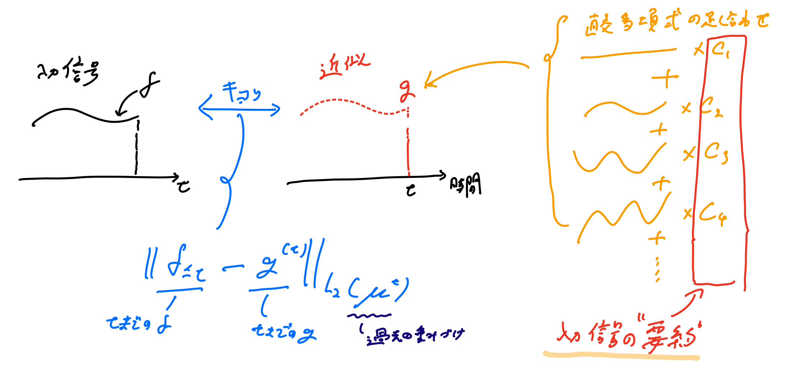
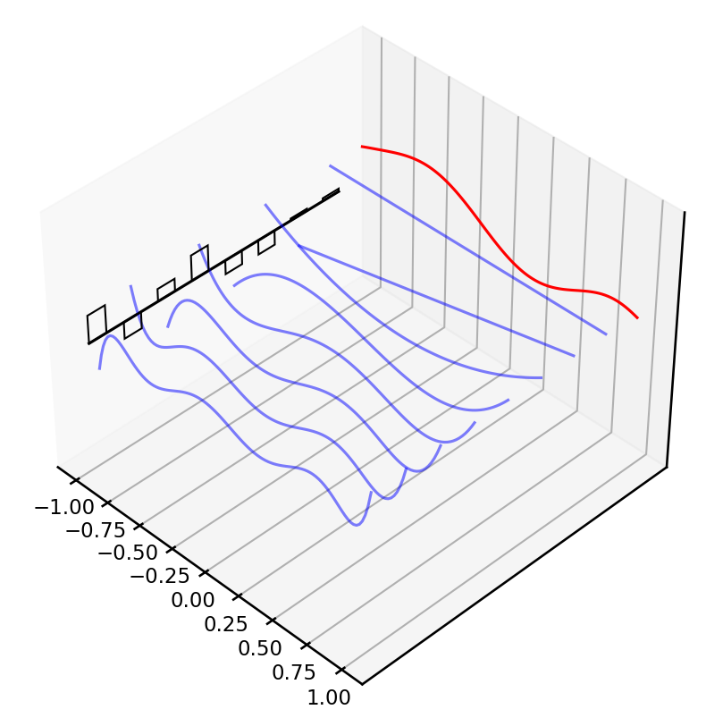
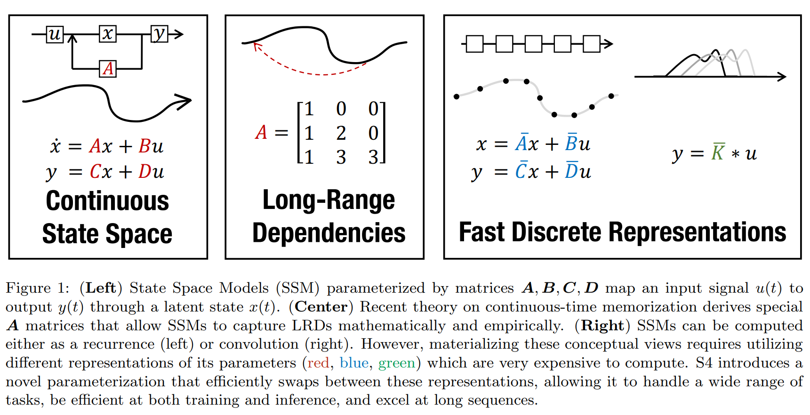
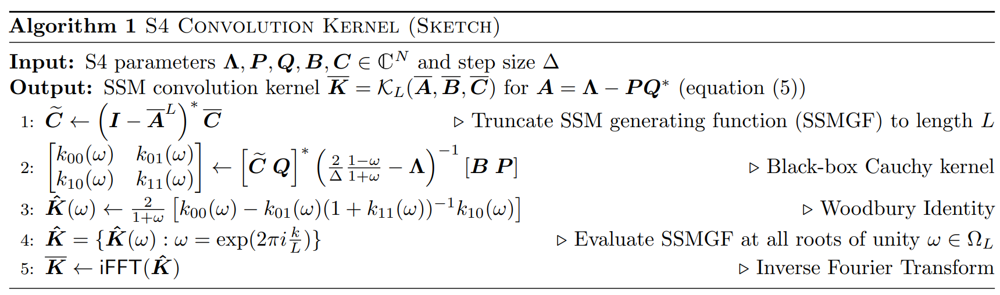
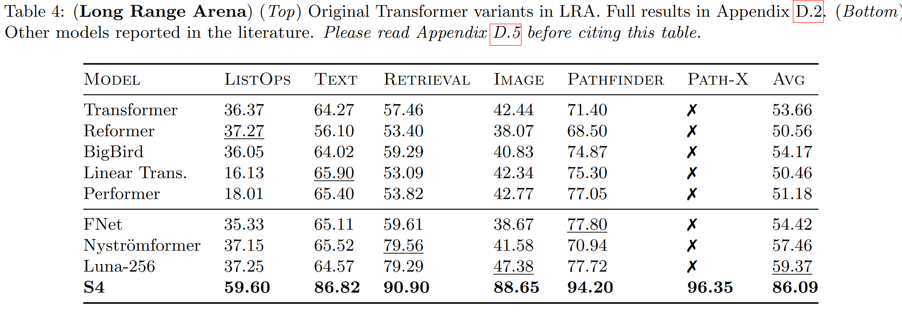

# HiPPOとS4の自分用まとめ

---

##  本スライドの目的
おもしろそうな下記の3つの論文のまとめを将来の自分のために残す。
- [Gu, Albert, et al. "Hippo: Recurrent memory with optimal polynomial projections." Advances in Neural Information Processing Systems 33 (2020): 1474-1487.](https://proceedings.neurips.cc/paper/2020/file/102f0bb6efb3a6128a3c750dd16729be-Paper.pdf)
- [Gu, Albert, et al. "Combining recurrent, convolutional, and continuous-time models with linear state space layers." Advances in neural information processing systems 34 (2021): 572-585.](https://arxiv.org/pdf/2110.13985.pdf)
- [Gu, Albert, Karan Goel, and Christopher Ré. "Efficiently modeling long sequences with structured state spaces." arXiv preprint arXiv:2111.00396 (2021).](https://arxiv.org/pdf/2111.00396v2.pdf)

---

## HiPPO とは？

一言でいうと、
- 長期的な”記憶”を保持しながら、オンラインで時系列データを”要約”するフレームワーク

---

## 背景
- 「時系列データのモデリングと学習」はいろんなところで使われる基本的な問題
  - 言語モデリング、音声認識、映像処理、強化学習

#### 時系列データをモデリング/学習する上での中心的な課題は？
- データが入ってくるにつれて増えていく過去のデータ ( history ) を**記憶**すること

#### 記憶するには、何が必要？
- history を取り扱いやすい表現に変えること
  - 蓄積される history を、有限のメモリで表す方法を獲得する必要がある
- 逐次的な history の表現の更新
  - 次々に入ってくるデータを逐次的に処理できるとうれしい

---

## 既存手法
- 過去の情報を取り込みながら、時間と共に変化していく状態をモデル化するアプローチ
    - RNN, LSTM, GRU, [フーリエ再帰ユニット](https://arxiv.org/pdf/1803.06585.pdf)、[ルジャンドル再帰ユニット](https://proceedings.neurips.cc/paper/2019/file/952285b9b7e7a1be5aa7849f32ffff05-Paper.pdf)

### 既存手法の課題
1. 数万ステップもあるようなデータだと記憶を保持できない
2. 入力データの時間スケールやシーケンス長に対して仮定をおいている
3. 「長期依存性をどの程度うまくとらえられるか」についての理論的保証がない

---

## HiPPOが解決したこと
1. 数百万ステップのデータでも記憶を保持できる（表現の獲得）
2. 時間スケールへの事前の仮定がなく、任意のシーケンス長の入力データを扱える
3. 記憶を扱う方法を理論的に定式化し、厳密な理論的保証を与える

---

## HiPPO (high-order polynomial projection operators)
  - 任意の関数を与えられた尺度に関して直交多項式空間に射影する演算子
    - 尺度：過去の各時刻のデータの重要度
- 入力関数 $f(t) : \mathbb{R}_+ \rightarrow \mathbb{R}$ が与えられたとき、逐次的に入ってくる入力を理解し、将来の予測を行うために、時刻 $t\ge 0$ ごとに累積 history $f_{\le t}:= f(x)|_{x\le t}$ を操作することが必要
  -   関数空間は非常に大きいので、history を完全に記憶することができない
  →圧縮する
  -   history を有界次元の部分空間に射影する
  -   しかも、圧縮した history の表現をオンラインで更新していく

---

## HiPPO の定式化
**[定義 1]**
- 時間 $t$ に伴って変化する $(-\infty, t]$ 上の測度族を $\mu^{(t)}$ 、多項式関数の $N$ 次元部分空間を $\mathcal{G}$ 、連続関数 $f:\mathbb{R}_{\ge0}\rightarrow \mathbb{R}$ とする。このとき、*HiPPO* は時間 $t$ ごとに射影演算子 $\text{proj}_t$ と係数抽出演算子 $\text{coef}_t$ を定義し、それらは以下の性質を持つ。
    1. $\text{proj}_t$ は、関数 $f$ を時間 $t$ までに制限した関数 $f_{\le t}:=f(x)|_{x\le t}$ をとり、$f_{\le t}$ を近似誤差 $\| f_{\le t} - g^{(t)} \|_{L_2 (\mu^{(t)})}$ が最小になる多項式 $g^{(t)}\in \mathcal{G}$ に写像する。
    2. $\text{coef}_t: \mathcal{G}\rightarrow \mathbb{R}^N$ は、多項式関数 $g^{(t)}$ を測度 $\mu^{(t)}$ に関して定義される直交多項式の基底の係数 $c(t)\in \mathbb{R}^N$ に写像する。

- 演算子の合成 $\text{coef}\circ \text{proj}$ を $\text{hippo}$ とよぶ。この演算子は関数 $f: \mathbb{R}_{\ge0}\rightarrow \mathbb{R}$ を最適な射影係数 $c:\mathbb{R}_{\ge0}\rightarrow \mathbb{R}^N$ に写像する。すなわち、$(\text{hippo}(f))(t)=\text{coef}_t(\text{proj}_t (f))$ である。

---

## HiPPO の概要図

---

## HiPPO の概要図
$f$ を $N$ 個の直交多項式 $g_n$ で張られる空間上に直交射影し、$g_n$ の足し合わせで表現できる $f$ に最も近い関数 $g = \sum^N_{n=1} c_n g_n$ を求め、$\{c_n\}$ によって $f$ を"要約"している。

---

## ルジャンドル多項式の可視化

8つのルジャンドル多項式 $\{g_n\}$ （青）の線型結合により、関数 $f$ （赤）を表現

>参考記事: https://srush.github.io/annotated-s4/

---

## Structured State Space for Sequence Modeling (S4) とは？
一言でいうと
- 状態空間モデルとDNNを組み合わせ、長いシーケンスを効率的にモデリングする手法
  - HiPPOフレームワークによる長期的な時間依存性への対処
  - 計算高速化のための多数の工夫
    - シーケンスを処理する Recurrent な部分を畳み込み Convolution の処理に置き換え並列化し、計算を高速化
    - HiPPO行列に制約を追加し、計算を高速化

---

## S4 の概要図

---

## 状態空間モデル (State Space Models) とは？
時刻を $t$ とする。状態空間モデルは、1次元の入力信号 $u(t)$ を$N$次元の隠れ状態 $x(t)$ に射影し、$x(t)$ を1次元の出力信号 $y(t)$ に射影するモデル。
以下の式で定義される。ここで、$\bm{A},\bm{B},\bm{C},\bm{D}$ はモデルのパラメータ。
$$
\begin{aligned}
x^{\prime}(t) &= \bm{A}x(t)+ \bm{B}u(t) \\
y(t) &= \bm{C}x(t)+\bm{D}u(t)
\end{aligned}
$$
S4 では時系列を取り扱うDNNのブラックボックス表現として状態空間モデルを利用する。
（S4では、$\bm{D}=0$ と仮定する。$\bm{D}u$ の項はスキップ接続とみなすことができ、計算が容易）

---

## 状態空間モデルの離散化

ステップサイズ $\Delta$ で連続関数 $u(t)$ を離散化。
これは、連続な信号 $u(t)$ を $\Delta$ ごとにサンプリングしているとみなせる。
$$
\begin{aligned}
x_k &= \bm{\overline{A}}x_{k-1} + \bm{\overline{B}}u_k \\
y_k &= \bm{\overline{C}}x_k
\end{aligned}
$$
ここで、パラメータ $\bm{A},\bm{B},\bm{C}$ をバイリニア法（双一次変換）を用いて離散化する。
各パラメータの近似行列 $\bm{\overline{A}}, \bm{\overline{B}}, \bm{\overline{C}}$ は、
$$
\begin{aligned}
\bm{\overline{A}} &= \left(\bm{I} - \frac{\Delta}{2}\cdot \bm{A} \right)^{-1} \left(\bm{I} + \frac{\Delta}{2}\cdot \bm{A} \right) \\
\bm{\overline{B}} &= \left(\bm{I} - \frac{\Delta}{2}\cdot \bm{A} \right)^{-1}\Delta \bm{B},\quad \bm{\overline{C}} = \bm{C}
\end{aligned}
$$

> 参考記事：[wiki/離散化](https://ja.wikipedia.org/wiki/%E9%9B%A2%E6%95%A3%E5%8C%96)、[連続時間システムの離散化手法の比較 [Python Scipy] ](https://blog.chachay.org/2021/05/discretization.html)

---

## 状態空間モデルの畳み込み表現
Recurrent な SSM は計算が遅い。並列化しやすい Convolutional な計算に変更する。
$$
\begin{aligned}
y_k &= \overline{\bm{C}}\overline{\bm{A}}^k\overline{\bm{B}}u_0 + \overline{\bm{C}}\overline{\bm{A}}^{k-1}\overline{\bm{B}}u_1 + \cdots + \overline{\bm{C}}\overline{\bm{A}}\overline{\bm{B}}u_{k-1} + \overline{\bm{C}}\overline{\bm{B}}u_k \\
y &= \overline{\bm{K}} * u
\end{aligned}
$$
ここで、畳み込みカーネル $\overline{\bm{K}}$ は
$$
\overline{\bm{K}} \in \mathbb{R}^L := \mathcal{K}_L\left(\overline{\bm{A}}, \overline{\bm{B}}, \overline{\bm{C}} \right) :=\left(\overline{\bm{C}}\overline{\bm{A}}^i\overline{\bm{B}} \right)_{i\in[L]} = \left(\overline{\bm{C}}\overline{\bm{B}},\ \overline{\bm{C}}\overline{\bm{A}}\overline{\bm{B}},\ \dots,\ \overline{\bm{C}}\overline{\bm{A}}^{L-1}\overline{\bm{B}} \right).
$$
以後、$\overline{\bm{K}}$ を SSM畳み込みカーネル または SSM畳み込みフィルター と呼ぶ。

---

## 畳み込みの高速化

畳み込みの計算は、高速フーリエ変換 (FFT) を用いて高速に計算できる。
- 畳み込みを直接計算（計算量：$O\left(N^2 \right)$）
- FFT $\mathcal{F}$ →積をとる→ iFFT $\mathcal{F}^{-1}$（計算量：$O\left(N\log N \right)$）

---

## S4 のアルゴリズム

---

## S4 のアルゴリズム
アルゴリズムを逆順で考えると、各ステップで何をしたいかがわかりやすい。
1. FFT→iFFTで高速化できる畳み込みの形にしたい
2. SSM畳み込みカーネルの逆行列の計算を高速化したいから、Woodbury の公式の形に持っていきたい
3. Woodbury の公式の形に持っていきたいから、状態空間モデルのパラメータ行列 $\bm{A}$ （HiPPO行列）に制限を加え、NPLR/DPLRの形で表現する
4. 状態空間モデルのパラメータ行列 $\bm{C}$ を求めるかわりに $\tilde{\bm{C}}$ を直接求める

TODO:ほんまか？

---

## S4の性能まとめ

全てのデータセットで最高精度。世界で初めて PATH-X を解けたモデル。

> [Paper with Code の S4 の結果まとめ](https://paperswithcode.com/paper/efficiently-modeling-long-sequences-with-1)も参照のこと

---

## HiPPOとS4の実装

- https://github.com/HazyResearch/state-spaces