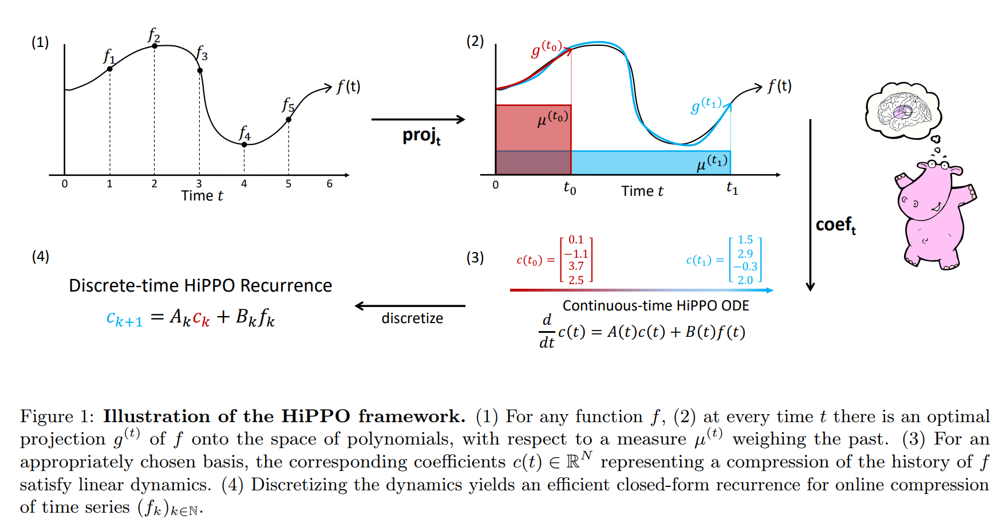

# HiPPOとS4の自分用まとめ

---

##  本スライドの目的
おもしろそうな下記の論文を読み込んで、将来の自分のためにまとめを残す。
- [Gu, Albert, et al. "Hippo: Recurrent memory with optimal polynomial projections." Advances in Neural Information Processing Systems 33 (2020): 1474-1487.](https://proceedings.neurips.cc/paper/2020/file/102f0bb6efb3a6128a3c750dd16729be-Paper.pdf)
- [Gu, Albert, et al. "Combining recurrent, convolutional, and continuous-time models with linear state space layers." Advances in neural information processing systems 34 (2021): 572-585.](https://arxiv.org/pdf/2110.13985.pdf)
- [Gu, Albert, Karan Goel, and Christopher Ré. "Efficiently modeling long sequences with structured state spaces." arXiv preprint arXiv:2111.00396 (2021).](https://arxiv.org/pdf/2111.00396v2.pdf)

---

## HiPPO とは？

一言でいうと、
- 長期的な”記憶”を保持しながら、オンラインで時系列データを”要約”するフレームワーク

---

## 背景
- **時系列データ**のモデリングと学習はいろんなところで使われる基本的な問題
  - 言語モデリング、音声認識、映像処理、強化学習

#### 時系列データをモデリング/学習する上での中心的な課題は？
- 多くのデータが処理されるにつれてどんどん増える過去のデータ (=history) を**記憶**すること

#### 記憶するには、何が必要？
- history を取り扱いやすい表現に変えること
  - 蓄積される history 全体を、有限のメモリで表す方法を獲得しなければならない
- 次々に入ってくるデータから、逐次的に「history の表現」を更新できなければならない

---

## 既存手法
- 過去の情報を取り込みながら、時間と共に変化していく状態をモデル化するアプローチ
    - RNN, LSTM, GRU, [フーリエ再帰ユニット](https://arxiv.org/pdf/1803.06585.pdf)、[ルジャンドル再帰ユニット](https://proceedings.neurips.cc/paper/2019/file/952285b9b7e7a1be5aa7849f32ffff05-Paper.pdf)

### 既存手法の課題
1. 数万ステップもあるようなデータだと記憶を保持できない
2. 入力データの時間スケールやシーケンス長に対して仮定をおいている
3. 「長期依存性をどの程度うまくとらえられるか」についての理論的保証がない

---

## HiPPOが解決したこと
1. 数百万ステップのデータでも記憶を保持できる（表現の獲得）
2. 時間スケールへの事前の仮定がなく、任意のシーケンス長の入力データを扱える
3. 記憶を扱う方法を理論的に定式化し、厳密な理論的保証を与える

---

## HiPPO (high-order polynomial projection operators)
  - 任意の関数を与えられた尺度に関して直交多項式空間に射影する演算子
    - 尺度：過去における各時刻のデータの重要度
- 入力関数 $f(t) : \mathbb{R}_+ \rightarrow \mathbb{R}$ が与えられたとき、逐次的に入ってくる入力を理解し、将来の予測を行うために、時刻 $t\ge 0$ ごとに累積 history $f_{\le t}:= f(x)|_{x\le t}$ を操作することが必要
  -   関数空間は非常に大きいので、history を完全に記憶することができない→圧縮する
  -   history を有界次元の部分空間に射影する
  -   しかも、圧縮した history の表現をオンラインで更新していく

---

## HiPPO の定式化
**[定義 1]**
- 時間 $t$ に伴って変化する $(-\infty, t]$ 上の測度族を $\mu^{(t)}$ 、多項式関数の $N$ 次元部分空間を $\mathcal{G}$ 、連続関数 $f:\mathbb{R}_{\ge0}\rightarrow \mathbb{R}$ とする。このとき、*HiPPO* は時間 $t$ ごとに射影演算子 $\text{proj}_t$ と係数抽出演算子 $\text{coef}_t$ を定義し、それらは以下の性質を持つ。
    1. $\text{proj}_t$ は、関数 $f$ を時間 $t$ までに制限した関数 $f_{\le t}:=f(x)|_{x\le t}$ をとり、$f_{\le t}$ を近似誤差 $\| f_{\le t} - g^{(t)} \|_{L_2 (\mu^{(t)})}$ が最小になる多項式 $g^{(t)}\in \mathcal{G}$ に写像する。
    2. $\text{coef}_t: \mathcal{G}\rightarrow \mathbb{R}^N$ は、多項式関数 $g^{(t)}$ を測度 $\mu^{(t)}$ に関して定義される直交多項式の基底の係数 $c(t)\in \mathbb{R}^N$ に写像する。

- 演算子の合成 $\text{coef}\circ \text{proj}$ を $\text{hippo}$ とよぶ。この演算子は関数 $f: \mathbb{R}_{\ge0}\rightarrow \mathbb{R}$ を最適な射影係数 $c:\mathbb{R}_{\ge0}\rightarrow \mathbb{R}^N$ に写像する。すなわち、$(\text{hippo}(f))(t)=\text{coef}_t(\text{proj}_t (f))$ である。

---

## HiPPO の概念図

---

## HiPPO の概念図
$f$ を $N$ 個の直交多項式 $g_n$ で張られる空間上に直交射影し、$g_n$ の足し合わせで表現できる $f$ に最も近い関数 $g = \sum^N_{n=1} c_n g_n$ を求め、$\{c_n\}$ によって $f$ を"要約"している。

---

## ルジャンドル多項式の可視化

8つのルジャンドル多項式 $\{g_n\}$ （青）の線型結合により、関数 $f$ （赤）を表現

参考: https://srush.github.io/annotated-s4/

---

## S4とは？
一言でいうと
- HiPPOのパラメータに制約を課し、計算高速化

---

## HiPPOとS4の実装

- https://github.com/HazyResearch/state-spaces

---

## S4の性能まとめ

- https://paperswithcode.com/paper/efficiently-modeling-long-sequences-with-1